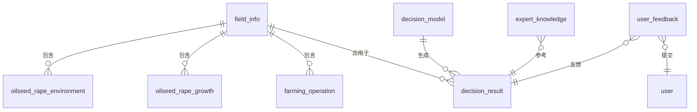

# 油菜生长决策系统数据库设计

## 1. 数据库概述

油菜生长决策系统数据库设计用于存储和管理油菜生长过程中的各类数据，包括环境数据、生长数据、决策模型和用户交互信息。

## 2. 数据库表结构设计

### 2.1 油菜生长环境数据表 (oilseed_rape_environment)

用于存储油菜生长环境的相关数据，包括气象、土壤等环境因素。

```sql
CREATE TABLE `oilseed_rape_environment` (
  `id` varchar(36) CHARACTER SET utf8mb4 COLLATE utf8mb4_unicode_ci NOT NULL COMMENT '主键ID',
  `create_by` varchar(50) CHARACTER SET utf8mb4 COLLATE utf8mb4_unicode_ci NULL DEFAULT NULL COMMENT '创建人',
  `create_time` datetime NULL DEFAULT NULL COMMENT '创建日期',
  `update_by` varchar(50) CHARACTER SET utf8mb4 COLLATE utf8mb4_unicode_ci NULL DEFAULT NULL COMMENT '更新人',
  `update_time` datetime NULL DEFAULT NULL COMMENT '更新日期',
  `sys_org_code` varchar(64) CHARACTER SET utf8mb4 COLLATE utf8mb4_unicode_ci NULL DEFAULT NULL COMMENT '所属部门',
  `tenant_id` varchar(32) CHARACTER SET utf8mb4 COLLATE utf8mb4_unicode_ci NULL DEFAULT NULL COMMENT '租户id',
  `field_id` varchar(36) CHARACTER SET utf8mb4 COLLATE utf8mb4_unicode_ci NOT NULL COMMENT '地块ID',
  `record_date` date NOT NULL COMMENT '记录日期',
  `temperature` decimal(5,2) NULL DEFAULT NULL COMMENT '平均温度(℃)',
  `humidity` decimal(5,2) NULL DEFAULT NULL COMMENT '相对湿度(%)',
  `rainfall` decimal(6,2) NULL DEFAULT NULL COMMENT '降雨量(mm)',
  `sunshine_hours` decimal(5,2) NULL DEFAULT NULL COMMENT '日照时长(h)',
  `soil_temperature` decimal(5,2) NULL DEFAULT NULL COMMENT '土壤温度(℃)',
  `soil_moisture` decimal(5,2) NULL DEFAULT NULL COMMENT '土壤湿度(%)',
  `soil_ph` decimal(4,2) NULL DEFAULT NULL COMMENT '土壤pH值',
  `soil_nitrogen` decimal(6,2) NULL DEFAULT NULL COMMENT '土壤氮含量(mg/kg)',
  `soil_phosphorus` decimal(6,2) NULL DEFAULT NULL COMMENT '土壤磷含量(mg/kg)',
  `soil_potassium` decimal(6,2) NULL DEFAULT NULL COMMENT '土壤钾含量(mg/kg)',
  `soil_organic_matter` decimal(5,2) NULL DEFAULT NULL COMMENT '土壤有机质含量(%)',
  `location` varchar(100) CHARACTER SET utf8mb4 COLLATE utf8mb4_unicode_ci NULL DEFAULT NULL COMMENT '地理位置',
  `remarks` varchar(500) CHARACTER SET utf8mb4 COLLATE utf8mb4_unicode_ci NULL DEFAULT NULL COMMENT '备注',
  PRIMARY KEY (`id`) USING BTREE,
  INDEX `idx_field_date`(`field_id`, `record_date`) USING BTREE
) ENGINE = InnoDB CHARACTER SET = utf8mb4 COLLATE = utf8mb4_unicode_ci COMMENT = '油菜生长环境数据表' ROW_FORMAT = DYNAMIC;
```

### 2.2 油菜生长数据表 (oilseed_rape_growth)

用于存储油菜生长过程中的各项指标数据。

```sql
CREATE TABLE `oilseed_rape_growth` (
  `id` varchar(36) CHARACTER SET utf8mb4 COLLATE utf8mb4_unicode_ci NOT NULL COMMENT '主键ID',
  `create_by` varchar(50) CHARACTER SET utf8mb4 COLLATE utf8mb4_unicode_ci NULL DEFAULT NULL COMMENT '创建人',
  `create_time` datetime NULL DEFAULT NULL COMMENT '创建日期',
  `update_by` varchar(50) CHARACTER SET utf8mb4 COLLATE utf8mb4_unicode_ci NULL DEFAULT NULL COMMENT '更新人',
  `update_time` datetime NULL DEFAULT NULL COMMENT '更新日期',
  `sys_org_code` varchar(64) CHARACTER SET utf8mb4 COLLATE utf8mb4_unicode_ci NULL DEFAULT NULL COMMENT '所属部门',
  `tenant_id` varchar(32) CHARACTER SET utf8mb4 COLLATE utf8mb4_unicode_ci NULL DEFAULT NULL COMMENT '租户id',
  `field_id` varchar(36) CHARACTER SET utf8mb4 COLLATE utf8mb4_unicode_ci NOT NULL COMMENT '地块ID',
  `record_date` date NOT NULL COMMENT '记录日期',
  `growth_stage` varchar(20) CHARACTER SET utf8mb4 COLLATE utf8mb4_unicode_ci NULL DEFAULT NULL COMMENT '生长阶段(播种期、苗期、蕾薹期、花期、角果期、成熟期)',
  `plant_height` decimal(5,2) NULL DEFAULT NULL COMMENT '株高(cm)',
  `leaf_count` int NULL DEFAULT NULL COMMENT '叶片数',
  `leaf_area_index` decimal(5,2) NULL DEFAULT NULL COMMENT '叶面积指数',
  `stem_diameter` decimal(4,2) NULL DEFAULT NULL COMMENT '茎粗(mm)',
  `biomass` decimal(8,2) NULL DEFAULT NULL COMMENT '生物量(g/m²)',
  `chlorophyll_content` decimal(5,2) NULL DEFAULT NULL COMMENT '叶绿素含量(SPAD值)',
  `disease_occurrence` varchar(200) CHARACTER SET utf8mb4 COLLATE utf8mb4_unicode_ci NULL DEFAULT NULL COMMENT '病虫害发生情况',
  `weed_coverage` decimal(5,2) NULL DEFAULT NULL COMMENT '杂草覆盖率(%)',
  `flowering_rate` decimal(5,2) NULL DEFAULT NULL COMMENT '开花率(%)',
  `pod_number` int NULL DEFAULT NULL COMMENT '单株角果数',
  `seed_weight` decimal(6,2) NULL DEFAULT NULL COMMENT '千粒重(g)',
  `yield_estimate` decimal(8,2) NULL DEFAULT NULL COMMENT '预估产量(kg/亩)',
  `remarks` varchar(500) CHARACTER SET utf8mb4 COLLATE utf8mb4_unicode_ci NULL DEFAULT NULL COMMENT '备注',
  PRIMARY KEY (`id`) USING BTREE,
  INDEX `idx_field_date`(`field_id`, `record_date`) USING BTREE
) ENGINE = InnoDB CHARACTER SET = utf8mb4 COLLATE = utf8mb4_unicode_ci COMMENT = '油菜生长数据表' ROW_FORMAT = DYNAMIC;
```

### 2.3 地块信息表 (field_info)

用于存储油菜种植地块的基本信息。

```sql
CREATE TABLE `field_info` (
  `id` varchar(36) CHARACTER SET utf8mb4 COLLATE utf8mb4_unicode_ci NOT NULL COMMENT '主键ID',
  `create_by` varchar(50) CHARACTER SET utf8mb4 COLLATE utf8mb4_unicode_ci NULL DEFAULT NULL COMMENT '创建人',
  `create_time` datetime NULL DEFAULT NULL COMMENT '创建日期',
  `update_by` varchar(50) CHARACTER SET utf8mb4 COLLATE utf8mb4_unicode_ci NULL DEFAULT NULL COMMENT '更新人',
  `update_time` datetime NULL DEFAULT NULL COMMENT '更新日期',
  `sys_org_code` varchar(64) CHARACTER SET utf8mb4 COLLATE utf8mb4_unicode_ci NULL DEFAULT NULL COMMENT '所属部门',
  `tenant_id` varchar(32) CHARACTER SET utf8mb4 COLLATE utf8mb4_unicode_ci NULL DEFAULT NULL COMMENT '租户id',
  `field_name` varchar(100) CHARACTER SET utf8mb4 COLLATE utf8mb4_unicode_ci NOT NULL COMMENT '地块名称',
  `field_code` varchar(50) CHARACTER SET utf8mb4 COLLATE utf8mb4_unicode_ci NULL DEFAULT NULL COMMENT '地块编码',
  `area` decimal(8,2) NULL DEFAULT NULL COMMENT '地块面积(亩)',
  `location` varchar(200) CHARACTER SET utf8mb4 COLLATE utf8mb4_unicode_ci NULL DEFAULT NULL COMMENT '地理位置',
  `soil_type` varchar(50) CHARACTER SET utf8mb4 COLLATE utf8mb4_unicode_ci NULL DEFAULT NULL COMMENT '土壤类型',
  `variety` varchar(100) CHARACTER SET utf8mb4 COLLATE utf8mb4_unicode_ci NULL DEFAULT NULL COMMENT '油菜品种',
  `sowing_date` date NULL DEFAULT NULL COMMENT '播种日期',
  `expected_harvest_date` date NULL DEFAULT NULL COMMENT '预计收获日期',
  `irrigation_type` varchar(50) CHARACTER SET utf8mb4 COLLATE utf8mb4_unicode_ci NULL DEFAULT NULL COMMENT '灌溉方式',
  `fertilization_plan` text CHARACTER SET utf8mb4 COLLATE utf8mb4_unicode_ci NULL COMMENT '施肥方案',
  `field_manager` varchar(50) CHARACTER SET utf8mb4 COLLATE utf8mb4_unicode_ci NULL DEFAULT NULL COMMENT '地块负责人',
  `contact_phone` varchar(20) CHARACTER SET utf8mb4 COLLATE utf8mb4_unicode_ci NULL DEFAULT NULL COMMENT '联系电话',
  `status` varchar(20) CHARACTER SET utf8mb4 COLLATE utf8mb4_unicode_ci NULL DEFAULT NULL COMMENT '状态(种植中、已收获、休耕)',
  `remarks` varchar(500) CHARACTER SET utf8mb4 COLLATE utf8mb4_unicode_ci NULL DEFAULT NULL COMMENT '备注',
  PRIMARY KEY (`id`) USING BTREE,
  UNIQUE INDEX `uk_field_code`(`field_code`) USING BTREE
) ENGINE = InnoDB CHARACTER SET = utf8mb4 COLLATE = utf8mb4_unicode_ci COMMENT = '地块信息表' ROW_FORMAT = DYNAMIC;
```

### 2.4 农事操作记录表 (farming_operation)

用于记录油菜种植过程中的各项农事操作。

```sql
CREATE TABLE `farming_operation` (
  `id` varchar(36) CHARACTER SET utf8mb4 COLLATE utf8mb4_unicode_ci NOT NULL COMMENT '主键ID',
  `create_by` varchar(50) CHARACTER SET utf8mb4 COLLATE utf8mb4_unicode_ci NULL DEFAULT NULL COMMENT '创建人',
  `create_time` datetime NULL DEFAULT NULL COMMENT '创建日期',
  `update_by` varchar(50) CHARACTER SET utf8mb4 COLLATE utf8mb4_unicode_ci NULL DEFAULT NULL COMMENT '更新人',
  `update_time` datetime NULL DEFAULT NULL COMMENT '更新日期',
  `sys_org_code` varchar(64) CHARACTER SET utf8mb4 COLLATE utf8mb4_unicode_ci NULL DEFAULT NULL COMMENT '所属部门',
  `tenant_id` varchar(32) CHARACTER SET utf8mb4 COLLATE utf8mb4_unicode_ci NULL DEFAULT NULL COMMENT '租户id',
  `field_id` varchar(36) CHARACTER SET utf8mb4 COLLATE utf8mb4_unicode_ci NOT NULL COMMENT '地块ID',
  `operation_type` varchar(50) CHARACTER SET utf8mb4 COLLATE utf8mb4_unicode_ci NOT NULL COMMENT '操作类型(播种、施肥、灌溉、除草、病虫害防治、采收等)',
  `operation_date` date NOT NULL COMMENT '操作日期',
  `operation_content` text CHARACTER SET utf8mb4 COLLATE utf8mb4_unicode_ci NULL COMMENT '操作内容描述',
  `materials_used` varchar(200) CHARACTER SET utf8mb4 COLLATE utf8mb4_unicode_ci NULL DEFAULT NULL COMMENT '使用物料(肥料、农药等)',
  `usage_amount` varchar(100) CHARACTER SET utf8mb4 COLLATE utf8mb4_unicode_ci NULL DEFAULT NULL COMMENT '使用量',
  `cost` decimal(8,2) NULL DEFAULT NULL COMMENT '操作成本(元)',
  `operator` varchar(50) CHARACTER SET utf8mb4 COLLATE utf8mb4_unicode_ci NULL DEFAULT NULL COMMENT '操作人员',
  `effect_evaluation` varchar(500) CHARACTER SET utf8mb4 COLLATE utf8mb4_unicode_ci NULL DEFAULT NULL COMMENT '效果评价',
  `next_operation_suggestion` varchar(500) CHARACTER SET utf8mb4 COLLATE utf8mb4_unicode_ci NULL DEFAULT NULL COMMENT '下次操作建议',
  `remarks` varchar(500) CHARACTER SET utf8mb4 COLLATE utf8mb4_unicode_ci NULL DEFAULT NULL COMMENT '备注',
  PRIMARY KEY (`id`) USING BTREE,
  INDEX `idx_field_date`(`field_id`, `operation_date`) USING BTREE
) ENGINE = InnoDB CHARACTER SET = utf8mb4 COLLATE = utf8mb4_unicode_ci COMMENT = '农事操作记录表' ROW_FORMAT = DYNAMIC;
```

### 2.5 决策模型表 (decision_model)

用于存储油菜生长决策模型的配置信息。

```sql
CREATE TABLE `decision_model` (
  `id` varchar(36) CHARACTER SET utf8mb4 COLLATE utf8mb4_unicode_ci NOT NULL COMMENT '主键ID',
  `create_by` varchar(50) CHARACTER SET utf8mb4 COLLATE utf8mb4_unicode_ci NULL DEFAULT NULL COMMENT '创建人',
  `create_time` datetime NULL DEFAULT NULL COMMENT '创建日期',
  `update_by` varchar(50) CHARACTER SET utf8mb4 COLLATE utf8mb4_unicode_ci NULL DEFAULT NULL COMMENT '更新人',
  `update_time` datetime NULL DEFAULT NULL COMMENT '更新日期',
  `sys_org_code` varchar(64) CHARACTER SET utf8mb4 COLLATE utf8mb4_unicode_ci NULL DEFAULT NULL COMMENT '所属部门',
  `tenant_id` varchar(32) CHARACTER SET utf8mb4 COLLATE utf8mb4_unicode_ci NULL DEFAULT NULL COMMENT '租户id',
  `model_name` varchar(100) CHARACTER SET utf8mb4 COLLATE utf8mb4_unicode_ci NOT NULL COMMENT '模型名称',
  `model_type` varchar(50) CHARACTER SET utf8mb4 COLLATE utf8mb4_unicode_ci NOT NULL COMMENT '模型类型(产量预测、病虫害预警、施肥建议、灌溉建议等)',
  `model_version` varchar(20) CHARACTER SET utf8mb4 COLLATE utf8mb4_unicode_ci NULL DEFAULT NULL COMMENT '模型版本',
  `model_description` text CHARACTER SET utf8mb4 COLLATE utf8mb4_unicode_ci NULL COMMENT '模型描述',
  `input_parameters` text CHARACTER SET utf8mb4 COLLATE utf8mb4_unicode_ci NULL COMMENT '输入参数(JSON格式)',
  `output_parameters` text CHARACTER SET utf8mb4 COLLATE utf8mb4_unicode_ci NULL COMMENT '输出参数(JSON格式)',
  `model_algorithm` varchar(100) CHARACTER SET utf8mb4 COLLATE utf8mb4_unicode_ci NULL DEFAULT NULL COMMENT '算法类型',
  `model_file_path` varchar(255) CHARACTER SET utf8mb4 COLLATE utf8mb4_unicode_ci NULL DEFAULT NULL COMMENT '模型文件路径',
  `accuracy` decimal(5,2) NULL DEFAULT NULL COMMENT '模型准确率(%)',
  `training_data_source` varchar(200) CHARACTER SET utf8mb4 COLLATE utf8mb4_unicode_ci NULL DEFAULT NULL COMMENT '训练数据来源',
  `applicable_conditions` text CHARACTER SET utf8mb4 COLLATE utf8mb4_unicode_ci NULL COMMENT '适用条件',
  `status` varchar(20) CHARACTER SET utf8mb4 COLLATE utf8mb4_unicode_ci NULL DEFAULT NULL COMMENT '状态(启用、禁用、测试中)',
  `remarks` varchar(500) CHARACTER SET utf8mb4 COLLATE utf8mb4_unicode_ci NULL DEFAULT NULL COMMENT '备注',
  PRIMARY KEY (`id`) USING BTREE
) ENGINE = InnoDB CHARACTER SET = utf8mb4 COLLATE = utf8mb4_unicode_ci COMMENT = '决策模型表' ROW_FORMAT = DYNAMIC;
```

### 2.6 决策结果表 (decision_result)

用于存储决策模型生成的决策结果。

```sql
CREATE TABLE `decision_result` (
  `id` varchar(36) CHARACTER SET utf8mb4 COLLATE utf8mb4_unicode_ci NOT NULL COMMENT '主键ID',
  `create_by` varchar(50) CHARACTER SET utf8mb4 COLLATE utf8mb4_unicode_ci NULL DEFAULT NULL COMMENT '创建人',
  `create_time` datetime NULL DEFAULT NULL COMMENT '创建日期',
  `update_by` varchar(50) CHARACTER SET utf8mb4 COLLATE utf8mb4_unicode_ci NULL DEFAULT NULL COMMENT '更新人',
  `update_time` datetime NULL DEFAULT NULL COMMENT '更新日期',
  `sys_org_code` varchar(64) CHARACTER SET utf8mb4 COLLATE utf8mb4_unicode_ci NULL DEFAULT NULL COMMENT '所属部门',
  `tenant_id` varchar(32) CHARACTER SET utf8mb4 COLLATE utf8mb4_unicode_ci NULL DEFAULT NULL COMMENT '租户id',
  `field_id` varchar(36) CHARACTER SET utf8mb4 COLLATE utf8mb4_unicode_ci NOT NULL COMMENT '地块ID',
  `model_id` varchar(36) CHARACTER SET utf8mb4 COLLATE utf8mb4_unicode_ci NOT NULL COMMENT '模型ID',
  `decision_date` date NOT NULL COMMENT '决策日期',
  `decision_type` varchar(50) CHARACTER SET utf8mb4 COLLATE utf8mb4_unicode_ci NOT NULL COMMENT '决策类型(产量预测、病虫害预警、施肥建议、灌溉建议等)',
  `decision_content` text CHARACTER SET utf8mb4 COLLATE utf8mb4_unicode_ci NOT NULL COMMENT '决策内容',
  `confidence_level` decimal(5,2) NULL DEFAULT NULL COMMENT '置信度(%)',
  `input_data` text CHARACTER SET utf8mb4 COLLATE utf8mb4_unicode_ci NULL COMMENT '输入数据(JSON格式)',
  `execution_status` varchar(20) CHARACTER SET utf8mb4 COLLATE utf8mb4_unicode_ci NULL DEFAULT NULL COMMENT '执行状态(待执行、执行中、已完成、已取消)',
  `execution_result` text CHARACTER SET utf8mb4 COLLATE utf8mb4_unicode_ci NULL COMMENT '执行结果',
  `execution_feedback` varchar(500) CHARACTER SET utf8mb4 COLLATE utf8mb4_unicode_ci NULL DEFAULT NULL COMMENT '执行反馈',
  `economic_benefit` decimal(10,2) NULL DEFAULT NULL COMMENT '经济效益(元)',
  `remarks` varchar(500) CHARACTER SET utf8mb4 COLLATE utf8mb4_unicode_ci NULL DEFAULT NULL COMMENT '备注',
  PRIMARY KEY (`id`) USING BTREE,
  INDEX `idx_field_date`(`field_id`, `decision_date`) USING BTREE,
  INDEX `idx_model_date`(`model_id`, `decision_date`) USING BTREE
) ENGINE = InnoDB CHARACTER SET = utf8mb4 COLLATE = utf8mb4_unicode_ci COMMENT = '决策结果表' ROW_FORMAT = DYNAMIC;
```

### 2.7 专家知识库表 (expert_knowledge)

用于存储油菜种植的专家知识和经验。

```sql
CREATE TABLE `expert_knowledge` (
  `id` varchar(36) CHARACTER SET utf8mb4 COLLATE utf8mb4_unicode_ci NOT NULL COMMENT '主键ID',
  `create_by` varchar(50) CHARACTER SET utf8mb4 COLLATE utf8mb4_unicode_ci NULL DEFAULT NULL COMMENT '创建人',
  `create_time` datetime NULL DEFAULT NULL COMMENT '创建日期',
  `update_by` varchar(50) CHARACTER SET utf8mb4 COLLATE utf8mb4_unicode_ci NULL DEFAULT NULL COMMENT '更新人',
  `update_time` datetime NULL DEFAULT NULL COMMENT '更新日期',
  `sys_org_code` varchar(64) CHARACTER SET utf8mb4 COLLATE utf8mb4_unicode_ci NULL DEFAULT NULL COMMENT '所属部门',
  `tenant_id` varchar(32) CHARACTER SET utf8mb4 COLLATE utf8mb4_unicode_ci NULL DEFAULT NULL COMMENT '租户id',
  `knowledge_type` varchar(50) CHARACTER SET utf8mb4 COLLATE utf8mb4_unicode_ci NOT NULL COMMENT '知识类型(种植技术、病虫害防治、施肥管理、灌溉管理等)',
  `knowledge_title` varchar(200) CHARACTER SET utf8mb4 COLLATE utf8mb4_unicode_ci NOT NULL COMMENT '知识标题',
  `knowledge_content` text CHARACTER SET utf8mb4 COLLATE utf8mb4_unicode_ci NOT NULL COMMENT '知识内容',
  `applicable_stage` varchar(100) CHARACTER SET utf8mb4 COLLATE utf8mb4_unicode_ci NULL DEFAULT NULL COMMENT '适用生长阶段',
  `applicable_region` varchar(200) CHARACTER SET utf8mb4 COLLATE utf8mb4_unicode_ci NULL DEFAULT NULL COMMENT '适用地区',
  `source` varchar(100) CHARACTER SET utf8mb4 COLLATE utf8mb4_unicode_ci NULL DEFAULT NULL COMMENT '知识来源',
  `expert_name` varchar(50) CHARACTER SET utf8mb4 COLLATE utf8mb4_unicode_ci NULL DEFAULT NULL COMMENT '专家姓名',
  `expert_title` varchar(100) CHARACTER SET utf8mb4 COLLATE utf8mb4_unicode_ci NULL DEFAULT NULL COMMENT '专家职称',
  `keywords` varchar(200) CHARACTER SET utf8mb4 COLLATE utf8mb4_unicode_ci NULL DEFAULT NULL COMMENT '关键词',
  `view_count` int NULL DEFAULT 0 COMMENT '浏览次数',
  `useful_count` int NULL DEFAULT 0 COMMENT '有用次数',
  `status` varchar(20) CHARACTER SET utf8mb4 COLLATE utf8mb4_unicode_ci NULL DEFAULT NULL COMMENT '状态(发布、草稿、审核中)',
  `remarks` varchar(500) CHARACTER SET utf8mb4 COLLATE utf8mb4_unicode_ci NULL DEFAULT NULL COMMENT '备注',
  PRIMARY KEY (`id`) USING BTREE,
  INDEX `idx_type_stage`(`knowledge_type`, `applicable_stage`) USING BTREE
) ENGINE = InnoDB CHARACTER SET = utf8mb4 COLLATE = utf8mb4_unicode_ci COMMENT = '专家知识库表' ROW_FORMAT = DYNAMIC;
```

### 2.8 用户反馈表 (user_feedback)

用于收集用户对决策系统的反馈意见。

```sql
CREATE TABLE `user_feedback` (
  `id` varchar(36) CHARACTER SET utf8mb4 COLLATE utf8mb4_unicode_ci NOT NULL COMMENT '主键ID',
  `create_by` varchar(50) CHARACTER SET utf8mb4 COLLATE utf8mb4_unicode_ci NULL DEFAULT NULL COMMENT '创建人',
  `create_time` datetime NULL DEFAULT NULL COMMENT '创建日期',
  `update_by` varchar(50) CHARACTER SET utf8mb4 COLLATE utf8mb4_unicode_ci NULL DEFAULT NULL COMMENT '更新人',
  `update_time` datetime NULL DEFAULT NULL COMMENT '更新日期',
  `sys_org_code` varchar(64) CHARACTER SET utf8mb4 COLLATE utf8mb4_unicode_ci NULL DEFAULT NULL COMMENT '所属部门',
  `tenant_id` varchar(32) CHARACTER SET utf8mb4 COLLATE utf8mb4_unicode_ci NULL DEFAULT NULL COMMENT '租户id',
  `user_id` varchar(36) CHARACTER SET utf8mb4 COLLATE utf8mb4_unicode_ci NOT NULL COMMENT '用户ID',
  `decision_result_id` varchar(36) CHARACTER SET utf8mb4 COLLATE utf8mb4_unicode_ci NULL DEFAULT NULL COMMENT '决策结果ID',
  `feedback_type` varchar(50) CHARACTER SET utf8mb4 COLLATE utf8mb4_unicode_ci NOT NULL COMMENT '反馈类型(决策效果、系统功能、界面体验、其他)',
  `feedback_content` text CHARACTER SET utf8mb4 COLLATE utf8mb4_unicode_ci NOT NULL COMMENT '反馈内容',
  `rating` int NULL DEFAULT NULL COMMENT '评分(1-5分)',
  `feedback_date` datetime NULL DEFAULT NULL COMMENT '反馈时间',
  `attachment` varchar(255) CHARACTER SET utf8mb4 COLLATE utf8mb4_unicode_ci NULL DEFAULT NULL COMMENT '附件路径',
  `process_status` varchar(20) CHARACTER SET utf8mb4 COLLATE utf8mb4_unicode_ci NULL DEFAULT NULL COMMENT '处理状态(待处理、处理中、已处理)',
  `process_result` varchar(500) CHARACTER SET utf8mb4 COLLATE utf8mb4_unicode_ci NULL DEFAULT NULL COMMENT '处理结果',
  `process_user` varchar(50) CHARACTER SET utf8mb4 COLLATE utf8mb4_unicode_ci NULL DEFAULT NULL COMMENT '处理人',
  `process_time` datetime NULL DEFAULT NULL COMMENT '处理时间',
  `remarks` varchar(500) CHARACTER SET utf8mb4 COLLATE utf8mb4_unicode_ci NULL DEFAULT NULL COMMENT '备注',
  PRIMARY KEY (`id`) USING BTREE,
  INDEX `idx_user_date`(`user_id`, `feedback_date`) USING BTREE
) ENGINE = InnoDB CHARACTER SET = utf8mb4 COLLATE = utf8mb4_unicode_ci COMMENT = '用户反馈表' ROW_FORMAT = DYNAMIC;
```

## 3. 数据库关系图



## 4. 索引设计

### 4.1 主要索引

1. **field_info表**:
   - 主键索引: `id`
   - 唯一索引: `field_code`

2. **oilseed_rape_environment表**:
   - 主键索引: `id`
   - 复合索引: `(field_id, record_date)`

3. **oilseed_rape_growth表**:
   - 主键索引: `id`
   - 复合索引: `(field_id, record_date)`

4. **farming_operation表**:
   - 主键索引: `id`
   - 复合索引: `(field_id, operation_date)`

5. **decision_model表**:
   - 主键索引: `id`

6. **decision_result表**:
   - 主键索引: `id`
   - 复合索引: `(field_id, decision_date)`
   - 复合索引: `(model_id, decision_date)`

7. **expert_knowledge表**:
   - 主键索引: `id`
   - 复合索引: `(knowledge_type, applicable_stage)`

8. **user_feedback表**:
   - 主键索引: `id`
   - 复合索引: `(user_id, feedback_date)`

## 5. 数据字典

### 5.1 字段说明

#### 5.1.1 通用字段

- `id`: 主键ID，使用UUID格式
- `create_by`: 创建人
- `create_time`: 创建时间
- `update_by`: 更新人
- `update_time`: 更新时间
- `sys_org_code`: 所属部门代码
- `tenant_id`: 租户ID，用于多租户支持

#### 5.1.2 业务字段

- **field_id**: 地块ID，关联field_info表
- **record_date**: 记录日期，用于数据时间序列分析
- **growth_stage**: 生长阶段，枚举值：播种期、苗期、蕾薹期、花期、角果期、成熟期
- **operation_type**: 操作类型，枚举值：播种、施肥、灌溉、除草、病虫害防治、采收等
- **decision_type**: 决策类型，枚举值：产量预测、病虫害预警、施肥建议、灌溉建议等
- **model_type**: 模型类型，枚举值：产量预测、病虫害预警、施肥建议、灌溉建议等
- **knowledge_type`: 知识类型，枚举值：种植技术、病虫害防治、施肥管理、灌溉管理等
- **feedback_type`: 反馈类型，枚举值：决策效果、系统功能、界面体验、其他
- **status**: 状态字段，根据不同表有不同的枚举值

## 6. 数据初始化

### 6.1 初始数据

```sql
-- 插入默认决策模型
INSERT INTO `decision_model` (`id`, `create_by`, `create_time`, `model_name`, `model_type`, `model_version`, `model_description`, `input_parameters`, `output_parameters`, `model_algorithm`, `accuracy`, `status`) VALUES
('1', 'admin', NOW(), '油菜产量预测模型', '产量预测', '1.0', '基于环境数据和生长数据预测油菜产量', '{"temperature": "float", "rainfall": "float", "soil_moisture": "float", "plant_height": "float", "leaf_area_index": "float"}', '{"yield": "float", "confidence": "float"}', '随机森林', '85.5', '启用'),
('2', 'admin', NOW(), '油菜病虫害预警模型', '病虫害预警', '1.0', '基于环境条件预警油菜病虫害发生风险', '{"temperature": "float", "humidity": "float", "rainfall": "float", "growth_stage": "string"}', '{"risk_level": "string", "disease_type": "string", "confidence": "float"}', '逻辑回归', '82.3', '启用'),
('3', 'admin', NOW(), '油菜施肥建议模型', '施肥建议', '1.0', '基于土壤条件和生长阶段提供施肥建议', '{"soil_nitrogen": "float", "soil_phosphorus": "float", "soil_potassium": "float", "growth_stage": "string"}', '{"fertilizer_type": "string", "fertilizer_amount": "float", "application_time": "string"}', '决策树', '88.7', '启用'),
('4', 'admin', NOW(), '油菜灌溉建议模型', '灌溉建议', '1.0', '基于土壤湿度和天气条件提供灌溉建议', '{"soil_moisture": "float", "temperature": "float", "rainfall": "float", "growth_stage": "string"}', {"irrigation": "boolean", "irrigation_amount": "float", "irrigation_time": "string"}', '神经网络', '86.2', '启用');

-- 插入示例专家知识
INSERT INTO `expert_knowledge` (`id`, `create_by`, `create_time`, `knowledge_type`, `knowledge_title`, `knowledge_content`, `applicable_stage`, `applicable_region`, `expert_name`, `expert_title`, `keywords`, `status`) VALUES
('1', 'admin', NOW(), '种植技术', '油菜播种技术要点', '油菜播种应选择适宜的时间，一般在秋季9-10月播种，播种深度2-3厘米，行距30-40厘米，播种量每亩0.3-0.5公斤。播种前应进行种子处理，包括晒种、浸种等，提高发芽率。', '播种期', '长江流域', '张农业', '农业技术推广研究员', '油菜,播种,技术', '发布'),
('2', 'admin', NOW(), '病虫害防治', '油菜菌核病防治方法', '油菜菌核病是油菜的主要病害之一，防治方法包括：1.选用抗病品种；2.合理轮作，避免与十字花科作物连作；3.控制田间湿度，及时排水；4.发病初期可使用多菌灵、甲基托布津等药剂防治。', '花期', '全国', '李植保', '植物保护专家', '油菜,菌核病,防治', '发布'),
('3', 'admin', NOW(), '施肥管理', '油菜施肥技术要点', '油菜施肥应遵循"基肥为主，追肥为辅"的原则。基肥以有机肥为主，配合磷钾肥；追肥主要在苗期和蕾薹期进行，以氮肥为主。一般每亩需施纯氮12-15公斤，五氧化二磷5-7公斤，氧化钾5-7公斤。', '苗期,蕾薹期', '全国', '王土壤', '土壤肥料专家', '油菜,施肥,营养', '发布'),
('4', 'admin', NOW(), '灌溉管理', '油菜灌溉技术要点', '油菜需水量较大，特别是在苗期和花期。灌溉应遵循"见干见湿"的原则，避免田间积水。一般苗期保持土壤湿度60-70%，花期保持70-80%。干旱季节应及时灌溉，每次灌溉量不宜过大，以湿润耕层为宜。', '苗期,花期', '全国', '赵水利', '农业水利专家', '油菜,灌溉,水分管理', '发布');
```

## 7. 数据库维护

### 7.1 备份策略

1. **全量备份**: 每周进行一次全量备份
2. **增量备份**: 每天进行一次增量备份
3. **备份保留**: 全量备份保留1个月，增量备份保留1周

### 7.2 性能优化

1. **定期分析表**: 每月执行一次表分析，更新统计信息
2. **索引优化**: 根据查询模式调整索引策略
3. **分区策略**: 对大数据量表可考虑按时间分区

### 7.3 数据清理

1. **日志数据**: 保留1年的操作日志
2. **临时数据**: 定期清理临时表和过期数据
3. **归档策略**: 对历史数据进行归档处理

## 8. 安全考虑

1. **数据加密**: 敏感字段加密存储
2. **访问控制**: 基于角色的访问控制
3. **审计日志**: 记录数据变更日志
4. **备份加密**: 备份数据加密存储

## 9. 扩展性设计

1. **多租户支持**: 通过tenant_id字段支持多租户
2. **分布式架构**: 支持数据库分片和读写分离
3. **缓存策略**: 对热点数据使用缓存提高性能
4. **API接口**: 提供标准化的数据访问接口