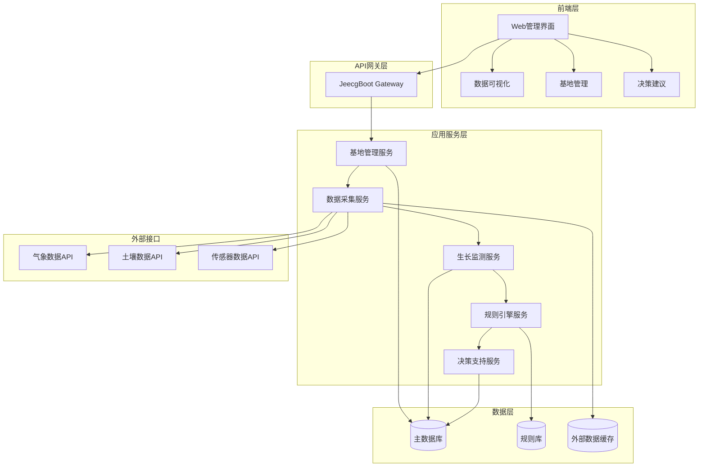
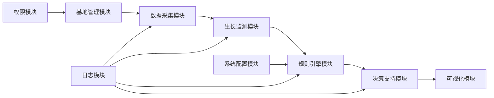
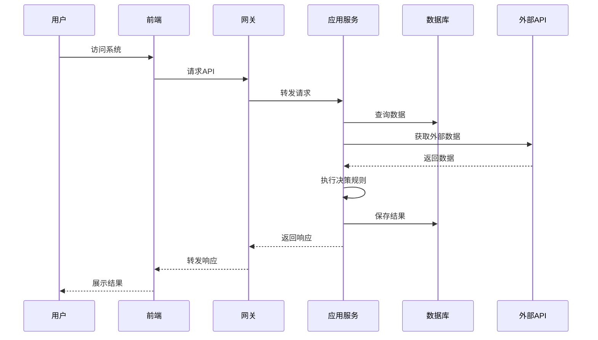

# 油菜生长决策系统 - 系统设计文档

## 整体架构图



## 分层设计

### 1. 前端层 (Presentation Layer)
- **技术栈**: Vue3 + TypeScript + Ant Design Vue4
- **功能模块**:
  - 基地管理界面
  - 数据采集界面
  - 生长监测界面
  - 决策建议界面
  - 数据可视化界面

### 2. API网关层 (Gateway Layer)
- **技术栈**: JeecgBoot Gateway
- **功能**:
  - 统一API入口
  - 路由转发
  - 权限验证
  - 限流控制

### 3. 应用服务层 (Application Service Layer)
- **技术栈**: Spring Boot + MyBatis-Plus
- **核心服务**:
  - 基地管理服务
  - 数据采集服务
  - 生长监测服务
  - 规则引擎服务
  - 决策支持服务

### 4. 数据层 (Data Layer)
- **技术栈**: MySQL + Redis
- **数据存储**:
  - 主数据库：业务数据
  - 规则库：决策规则
  - 缓存：外部数据和热点数据

## 核心组件

### 1. 基地管理组件
- 基地信息管理
- 用户权限分配
- 数据隔离控制

### 2. 数据采集组件
- 外部API对接
- 数据清洗转换
- 数据质量检查

### 3. 生长监测组件
- 生长阶段识别
- 生长状态评估
- 异常预警

### 4. 规则引擎组件
- 规则定义管理
- 规则推理执行
- 规则版本控制

### 5. 决策支持组件
- 决策模型构建
- 建议生成算法
- 建议优先级排序

## 模块依赖关系图



## 接口契约定义

### 1. 基地管理接口
```
POST /api/base/create - 创建基地
GET /api/base/list - 获取基地列表
PUT /api/base/update - 更新基地信息
DELETE /api/base/delete - 删除基地
```

### 2. 数据采集接口
```
POST /api/data/manual - 手动录入数据
GET /api/data/external - 获取外部数据
GET /api/data/history - 获取历史数据
```

### 3. 生长监测接口
```
GET /api/growth/stage - 获取生长阶段
POST /api/growth/record - 记录生长状态
GET /api/growth/alert - 获取预警信息
```

### 4. 决策支持接口
```
GET /api/decision/suggestion - 获取决策建议
POST /api/decision/feedback - 反馈建议效果
GET /api/decision/history - 获取决策历史
```

## 数据流向图



## 异常处理策略

### 1. 外部数据异常
- 超时处理：设置合理的超时时间和重试机制
- 数据格式异常：数据清洗和转换
- API不可用：降级处理，使用缓存数据

### 2. 规则引擎异常
- 规则冲突：优先级排序和冲突解决策略
- 规则执行异常：异常捕获和日志记录
- 规则库异常：备份规则和快速恢复

### 3. 系统异常
- 服务不可用：熔断机制和降级处理
- 数据库异常：事务回滚和数据一致性保证
- 网络异常：重试机制和补偿事务

## 设计原则

1. **模块化设计**：各模块职责单一，接口清晰
2. **可扩展性**：支持新基地、新数据源、新规则的扩展
3. **高可用性**：关键服务冗余部署，故障自动切换
4. **数据安全**：基地数据隔离，传输加密
5. **性能优化**：缓存热点数据，异步处理耗时操作