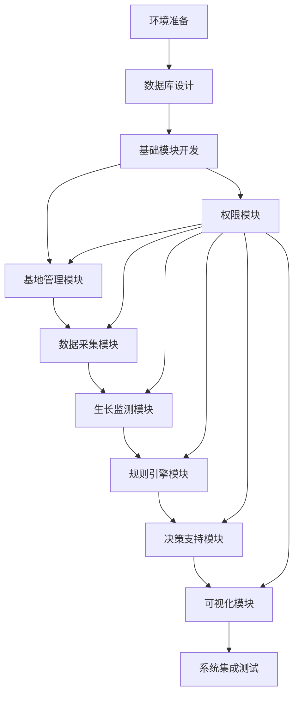

# 油菜生长决策系统 - 任务拆分文档

## 任务依赖图

## 原子任务列表

### 1. 环境准备 (ENV_SETUP)
**输入契约**:
- 前置依赖: 无
- 输入数据: 项目代码库
- 环境依赖: 开发环境、数据库环境

**输出契约**:
- 输出数据: 配置完成的开发环境
- 交付物: 开发环境配置文档
- 验收标准: 开发环境可正常启动项目

**实现约束**:
- 技术栈: JeecgBoot 3.8.2 + Vue3
- 接口规范: 遵循项目现有配置
- 质量要求: 环境配置完整，可正常开发

**依赖关系**:
- 后置任务: 数据库设计
- 并行任务: 无

### 2. 数据库设计 (DB_DESIGN)
**输入契约**:
- 前置依赖: 环境准备
- 输入数据: 需求文档、设计文档
- 环境依赖: 数据库环境

**输出契约**:
- 输出数据: 数据库设计文档、SQL脚本
- 交付物: 数据库表结构、索引、约束
- 验收标准: 表结构设计合理，满足业务需求

**实现约束**:
- 技术栈: MySQL 5.7+
- 接口规范: 遵循数据库设计规范
- 质量要求: 表结构清晰，命名规范，考虑性能优化

**依赖关系**:
- 后置任务: 基础模块开发
- 并行任务: 无

### 3. 基础模块开发 (BASE_MODULE)
**输入契约**:
- 前置依赖: 数据库设计
- 输入数据: 数据库设计文档、JeecgBoot基础框架
- 环境依赖: 开发环境

**输出契约**:
- 输出数据: 基础模块代码
- 交付物: 实体类、基础服务、基础接口
- 验收标准: 基础模块功能正常，代码规范

**实现约束**:
- 技术栈: Spring Boot + MyBatis-Plus
- 接口规范: RESTful API
- 质量要求: 代码复用性高，接口设计合理

**依赖关系**:
- 后置任务: 基地管理模块、权限模块
- 并行任务: 无

### 4. 权限模块 (AUTH_MODULE)
**输入契约**:
- 前置依赖: 基础模块开发
- 输入数据: 基础模块代码、权限需求
- 环境依赖: 开发环境

**输出契约**:
- 输出数据: 权限模块代码
- 交付物: 权限控制服务、多租户实现
- 验收标准: 权限控制有效，数据隔离正常

**实现约束**:
- 技术栈: JeecgBoot权限框架
- 接口规范: 遵循平台权限模型
- 质量要求: 数据安全，权限粒度合理

**依赖关系**:
- 后置任务: 基地管理模块、数据采集模块、生长监测模块、规则引擎模块、决策支持模块、可视化模块
- 并行任务: 无

### 5. 基地管理模块 (BASE_MANAGE)
**输入契约**:
- 前置依赖: 基础模块开发、权限模块
- 输入数据: 基础模块代码、权限模块代码、基地管理需求
- 环境依赖: 开发环境

**输出契约**:
- 输出数据: 基地管理模块代码
- 交付物: 基地管理服务、前端界面
- 验收标准: 基地管理功能完整，数据隔离有效

**实现约束**:
- 技术栈: Spring Boot + Vue3
- 接口规范: RESTful API
- 质量要求: 功能完整，用户体验良好

**依赖关系**:
- 后置任务: 数据采集模块
- 并行任务: 无

### 6. 数据采集模块 (DATA_COLLECTION)
**输入契约**:
- 前置依赖: 基地管理模块、权限模块
- 输入数据: 基地管理模块代码、权限模块代码、数据采集需求
- 环境依赖: 开发环境、外部API测试环境

**输出契约**:
- 输出数据: 数据采集模块代码
- 交付物: 数据采集服务、外部接口适配器、前端界面
- 验收标准: 数据采集功能正常，外部接口对接成功

**实现约束**:
- 技术栈: Spring Boot + HTTP客户端
- 接口规范: 外部API接口规范
- 质量要求: 数据采集稳定，异常处理完善

**依赖关系**:
- 后置任务: 生长监测模块
- 并行任务: 无

### 7. 生长监测模块 (GROWTH_MONITOR)
**输入契约**:
- 前置依赖: 数据采集模块、权限模块
- 输入数据: 数据采集模块代码、权限模块代码、生长监测需求
- 环境依赖: 开发环境

**输出契约**:
- 输出数据: 生长监测模块代码
- 交付物: 生长监测服务、生长阶段识别算法、前端界面
- 验收标准: 生长监测功能正常，阶段识别准确

**实现约束**:
- 技术栈: Spring Boot + 算法库
- 接口规范: RESTful API
- 质量要求: 监测准确，算法高效

**依赖关系**:
- 后置任务: 规则引擎模块
- 并行任务: 无

### 8. 规则引擎模块 (RULE_ENGINE)
**输入契约**:
- 前置依赖: 生长监测模块、权限模块
- 输入数据: 生长监测模块代码、权限模块代码、规则引擎需求
- 环境依赖: 开发环境

**输出契约**:
- 输出数据: 规则引擎模块代码
- 交付物: 规则引擎服务、规则管理界面
- 验收标准: 规则引擎功能正常，规则执行准确

**实现约束**:
- 技术栈: JeecgBoot规则引擎
- 接口规范: 规则定义规范
- 质量要求: 规则执行高效，冲突处理合理

**依赖关系**:
- 后置任务: 决策支持模块
- 并行任务: 无

### 9. 决策支持模块 (DECISION_SUPPORT)
**输入契约**:
- 前置依赖: 规则引擎模块、权限模块
- 输入数据: 规则引擎模块代码、权限模块代码、决策支持需求
- 环境依赖: 开发环境

**输出契约**:
- 输出数据: 决策支持模块代码
- 交付物: 决策支持服务、决策建议生成算法、前端界面
- 验收标准: 决策支持功能正常，建议合理有效

**实现约束**:
- 技术栈: Spring Boot + 算法库
- 接口规范: RESTful API
- 质量要求: 决策准确，建议实用

**依赖关系**:
- 后置任务: 可视化模块
- 并行任务: 无

### 10. 可视化模块 (VISUALIZATION)
**输入契约**:
- 前置依赖: 决策支持模块、权限模块
- 输入数据: 决策支持模块代码、权限模块代码、可视化需求
- 环境依赖: 开发环境

**输出契约**:
- 输出数据: 可视化模块代码
- 交付物: 数据可视化服务、图表组件、前端界面
- 验收标准: 可视化功能正常，图表清晰直观

**实现约束**:
- 技术栈: Vue3 + ECharts
- 接口规范: RESTful API
- 质量要求: 图表美观，交互友好

**依赖关系**:
- 后置任务: 系统集成测试
- 并行任务: 无

### 11. 系统集成测试 (INTEGRATION_TEST)
**输入契约**:
- 前置依赖: 可视化模块
- 输入数据: 所有模块代码、测试用例
- 环境依赖: 本地测试环境

**输出契约**:
- 输出数据: 测试报告、问题清单
- 交付物: 测试用例、测试报告
- 验收标准: 所有功能测试通过，性能达标

**实现约束**:
- 技术栈: JUnit + Selenium
- 接口规范: 测试规范
- 质量要求: 测试覆盖率高，问题定位准确

**依赖关系**:
- 后置任务: 无
- 并行任务: 无

## 拆分原则说明

1. **复杂度可控**：每个任务可在1-2周内完成，便于管理和控制
2. **功能模块化**：按业务功能划分，确保任务独立性和可测试性
3. **依赖关系清晰**：明确任务间的依赖关系，避免循环依赖
4. **验收标准明确**：每个任务都有明确的验收标准，便于质量控制
5. **技术栈一致**：所有任务使用统一的技术栈，降低技术复杂度